# Creating an auth0 application

TriggerMesh authentication is based on [Auth0](https://auth0.com). In order to deploy a TriggerMesh instance properly you need to create an Auth0 application first and get its `clientid` and `clientsecret`.

## Sign up or Login to Auth0

Here are the first three steps to follow:

1. Sign up or login to [auth0](https://auth0.com/auth/login)

1. If it is your first time using Auth0 you will need to create a _Tenant Domain_ as shown in the two snapshots below:  
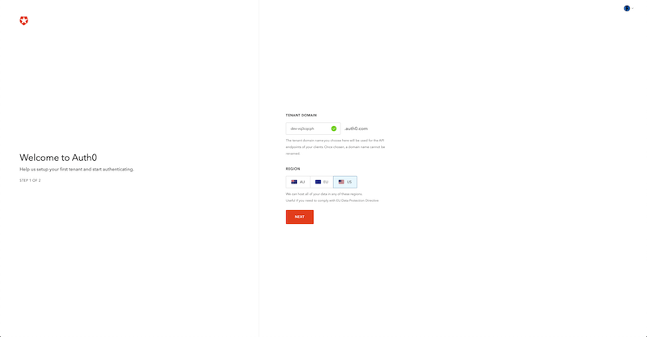
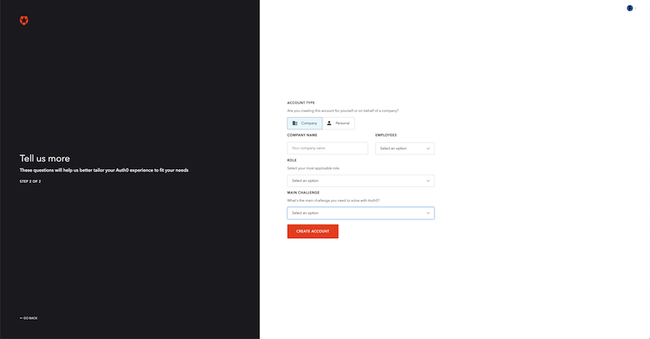  

1. If you are already using Auth0, you can create a new tenant for your TriggerMesh instance from the Dashboard view, by clicking on your account down arrow at the top right.  
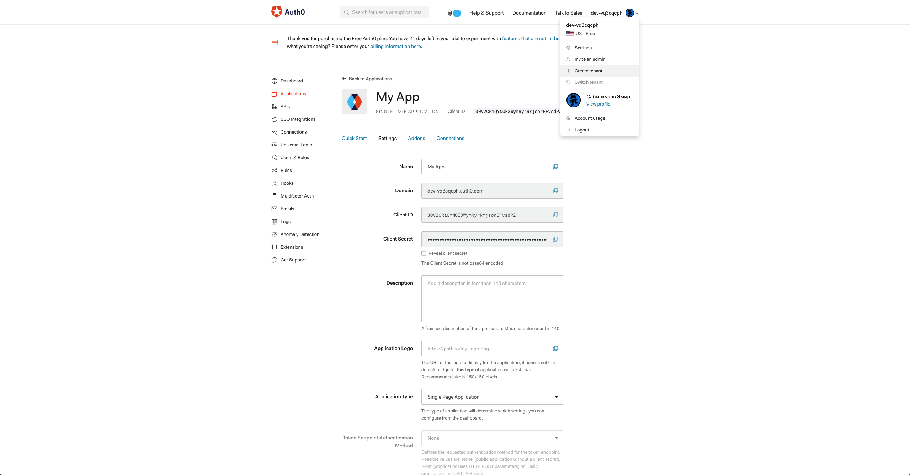

You are now ready to create two Auth0 applications. One for the TriggerMesh frontend and one for the TriggerMesh backend.

## Create Single page application

Single page app allows to create login page, show/modify login page UI.

1. Click on "Create application" button in the Dashboard view.  
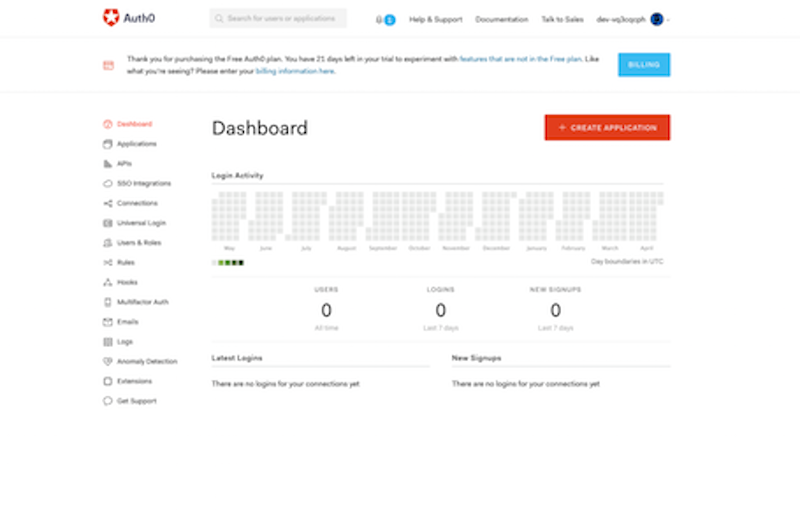

2. Type an application name and select "Single Page web Applications"  
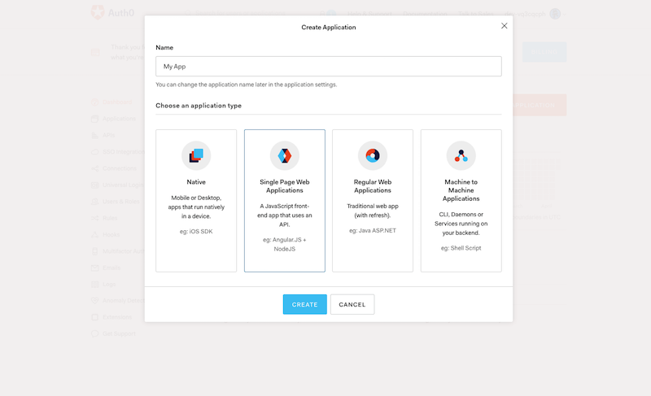

### Configure Single page application (SPA)

SPA purpose to control login page. It require some security settings like: allowed callback urls, allowed web origins.
SPA provide Client ID, which will be used on a login page and share with client.

Go to app settings:

1. Define **Allowed Callback URLs**  
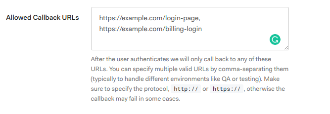
   - https://{DOMAIN_HERE}/build-triggers
   - https://{DOMAIN_HERE}/auth-callback
   - https://{DOMAIN_HERE}/function/create/
   - https://{DOMAIN_HERE}/build-triggers/create/
   - https://{DOMAIN_HERE}/function-triggers/create/

1. Define **Allowed web origins**  
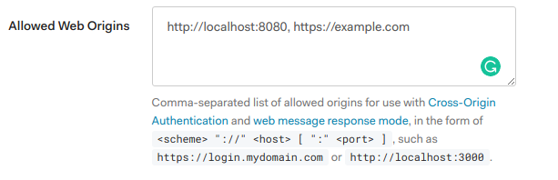

Go to app connections:

1. Select required Social auth providers:  
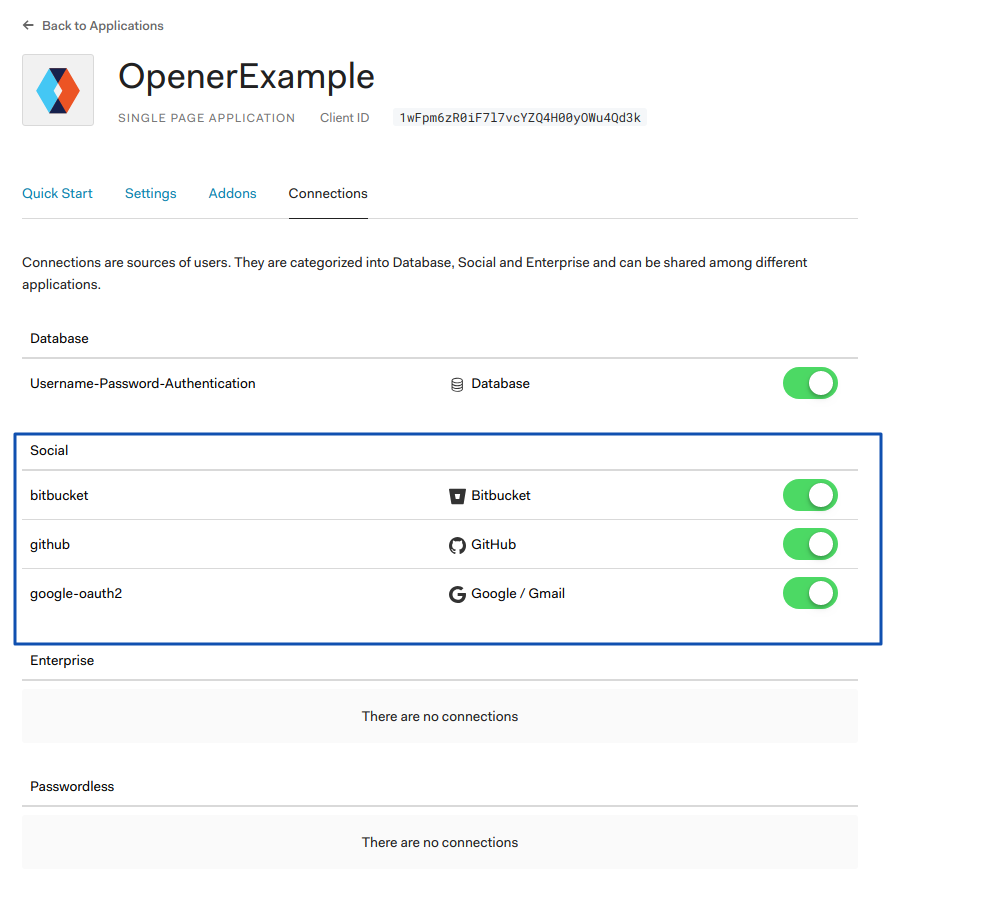

## Create Machine to Machine application (M2M)

M2M allows to work with auth0 Management API from backend: fetch oauth providers tokens, modify user and etc.

1. Click on "Create application" button in the Dashboard view.  

1. Define name and Select Machine to machine option:  
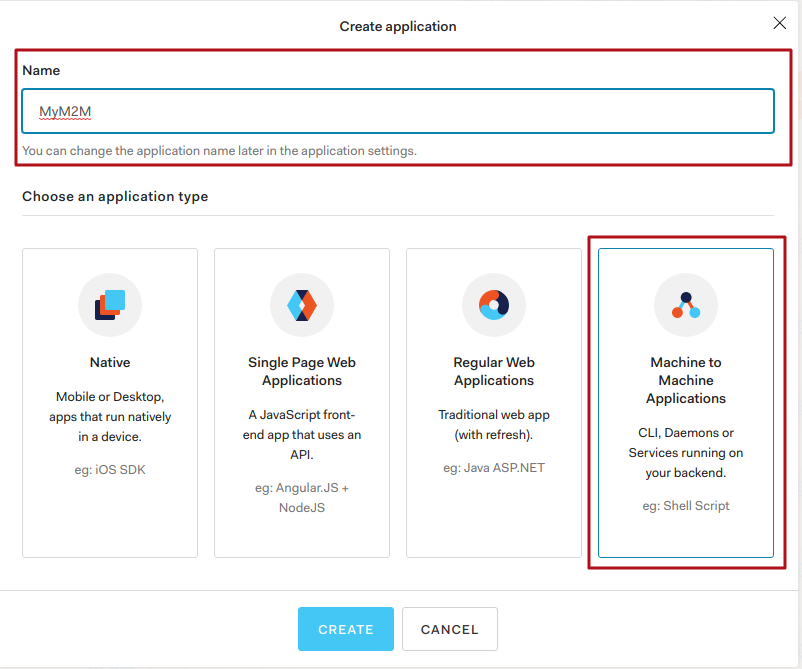

1. Select API  
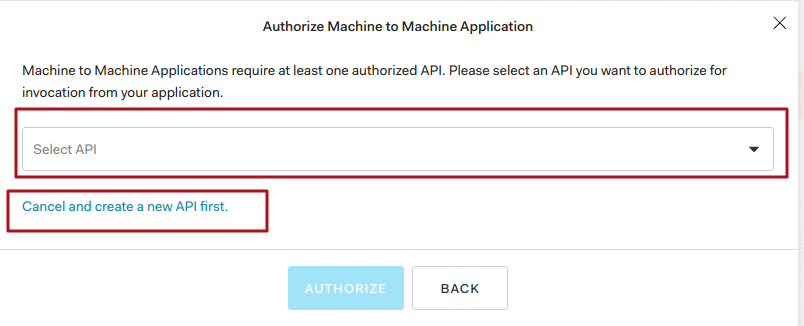

1. Select scopes for API: **update:users**, **read:users**, **read:user_idp_tokens**  
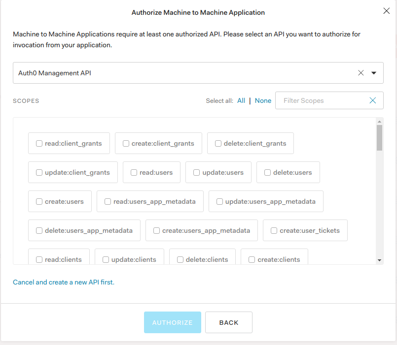

1. Make sure that API is authorized:  
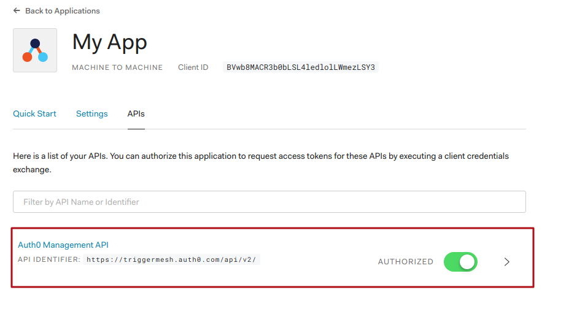

### Configure Machine application

1. Define **Allowed Callback URLs** in M2M settings:
   - https://{DOMAIN_HERE}/build-triggers
   - https://{DOMAIN_HERE}/auth-callback
   - https://{DOMAIN_HERE}/function/create/
   - https://{DOMAIN_HERE}/build-triggers/create/
   - https://{DOMAIN_HERE}/function-triggers/create/

Everything is ready for work:

- Take M2M **Client Secret** and **Client ID** and place it to backend ENV variable
- Take SPA **Client ID** and place to aut0 js sdk.